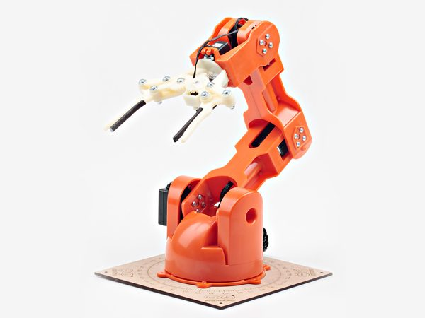
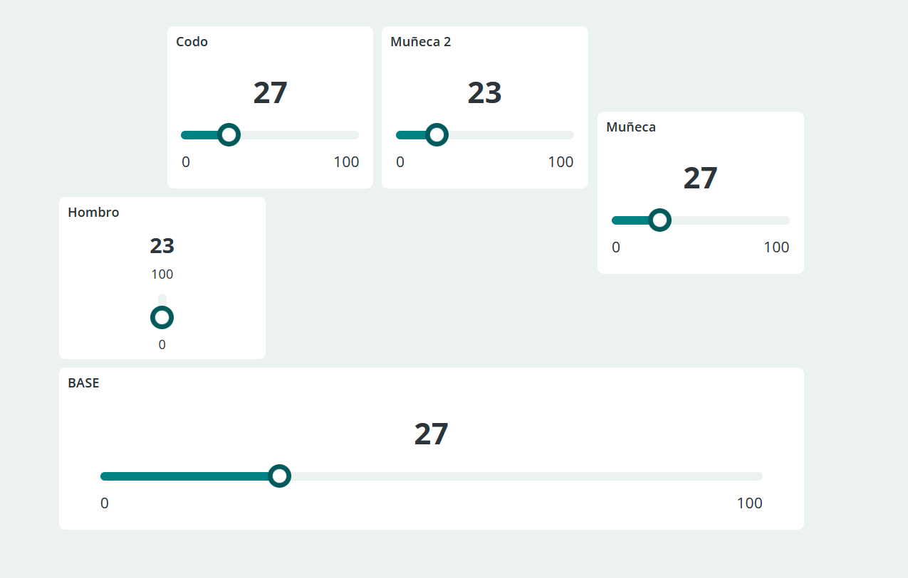

# 🤖 Braccio

## Proyecto Braccio para IoTUS

Este proyecto consiste en un brazo robótico a base de servomotores, que son controlados por un Arduino Nano 33 IoT.

Todas las conexiones se han realizaco usando Arduino Cloud, a la cual se puede acceder pinchando [aquí](https://app.arduino.cc/things).

Para controlarlo hemos usado el DashBoard Propio de Arduino Cloud, en la que tenemos diferentes *sliders* para controlar los grados de rotación de cada servomotor. Se vería de la siguiente forma:

Este proyecto forma parte de la asociación IoTUS de la Universidad de Sevilla.

Realizado por Miguel Toro y Alejandro xxx.

